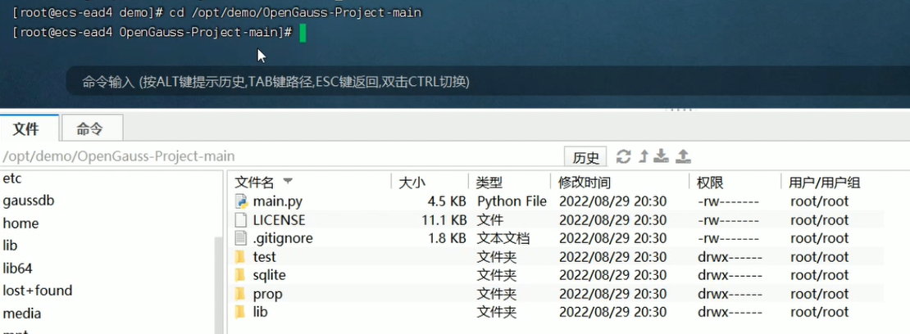
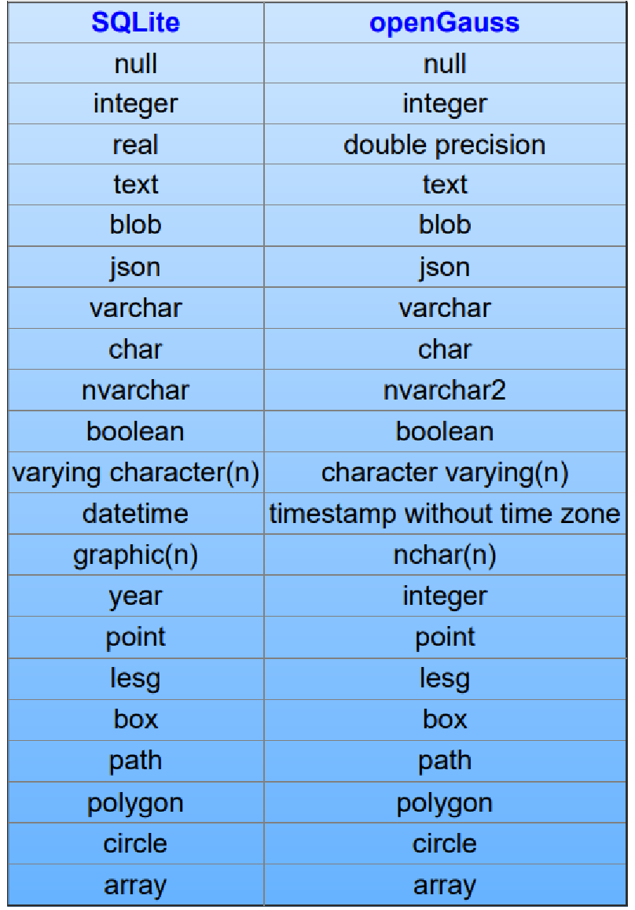

# SQLite2openGauss


### 目录
##### 第一章 工具介绍

##### 第二章 配置文件说明
###### 2.1 opengauss.properties

###### 2.2 sqlite.properties

##### 第三章 使用说明

###### 3.1 解压压缩文件并进入文件夹

###### 3.2 三种不同方式进行数据迁移

###### 3.3 日志信息

###### 3.4 数据迁移结果


##### 第四章 类型转换

###### 4.1 类型转换规则

###### 4.2 自增序列转换

###### 4.3 注释转换

###### 4.4 外键转换

###### 4.5 触发器转换

###### 4.6 视图转换

###### 4.7 索引转换

##### 第五章 其他说明

###### 5.1 执行 sql 出现网络错误时会重试

###### 5.2 非空字段约束的 SQLite 的空字符串''数值会被替换为单一空格的字符串' '
###### 5.3 使用注意


### 第一章 工具介绍


 本工具是一个用 Python 语言编写的将 SQLite 数据迁移至 openGauss 的轻量级数据库迁移工具。本工具基于 SQLite 的 dump 操作编写，同时使用数据库连接池获取openGauss数据库连接，实现多线程迁移数据。支持字段类型、主键、外键、索引、数据类型的自动转换，并且支持简单的视图、存储过程、触发器的迁移，以及生成数据迁移过程的提示日志、错误日志和SQL语句日志。


### 第二章 配置文件说明


#### 2.1 opengauss.properties

配置文件实例如下：

``` properties
database.name=postgres
database.schema=testSchema
database.host=120.46.202.30
database.port=260000
database.user=testUser
database.password=testPassword
```


每一项配置含义如下：

| 名称 | 含义 |
| -------- | -------- |
| database. name| openGauss的数据库名字     |
| database.schema     | 将要自动生成的openGauss的schema名字    |
| database.host    | openGauss的主机地址     |
| database.port     | openGauss的主机端口     |
| database.user    | openGauss的用户名     |
| database.password     | openGauss用户名对应的密码     |


#### 2.2 sqlite.properties

配置文件实例如下：

``` properties
database.filename=filmdb.sqlite
```

每一项配置含义如下：
| 名称 | 含义 |
| -------- | -------- |
| database.filename    | 将要迁移的SQLite数据库文件名称     |


### 第三章 使用说明

Python解释器版本为python3.9


#### 3.1 解压压缩文件并进入文件夹

解压
``` shell
unzip OpenGauss-Project-main.zip
```


进入文件夹
``` shell
cd OpenGauss-Project-main
```




#### 3.2 三种不同方式进行数据迁移


##### 3.2.1 方式一：直接执行main.py文件

``` shell
python main.py
```


输入openGauss数据库信息


保存信息至配置文件中


输入要迁移的SQLite数据库信息（注：输入的SQLite文件应在sqlite文件夹中）


保存信息至配置文件中


数据迁移中以及迁移完毕


##### 3.2.2 方式二：读取配置文件信息执行python main.py运行

``` shell
python main.py -o opengauss.properties -s sqlite.properties
```


数据迁移中以及迁移完毕


##### 3.2.3 方式三：通过-m参数采用多线程迁移数据

```
python main.py -o opengauss.properties -s sqlite.properties -m
```


数据迁移中以及迁移完毕


#### 3.3 日志信息

自动生成日志并进行分类管理


**info.log**: 数据库连接提示日志，用于存储数据库连接的信息<br>
**error.log**: 数据迁移错误信息日志，用于存储迁移过程中出现异常的提示信息<br>
**sqls.log**: SQL语句日志，用于存储迁移过程中被执行的SQL语句，可选择是否存储<br>


#### 3.4 数据迁移结果


#### 


### 第四章 类型转换


#### 4.1 类型转换规则


**特殊说明**：在SQLite数据库中中文字符占varchar中的一个字符，但在openGauss数据库中中文字符占了varchar的三个字符，故而在迁移时对于varchar数据类型的长度限制为原来的三倍以适配迁移过程中可能出现的长度超出限制的情况。


#### 4.2 自增序列转换

SQLite中的autoincrement类型的列中数据是自增的，对应于openGauss中的serial自增数据类型。但因为在SQlite中autoincrement列中的数据已经是自动生成的，在迁移过程中没有根据顺序进行迁移故而无法模拟添加每条记录时自动实现自增，openGauss也无法实现将列的数据类型转换为serial。在本项目中的解决方案为将SQLite数据库中autoincrement类型转变为openGauss中的integer类型，这样程序可以完整读取SQLite数据库中根据autoincrement自动生成的数据直接写入openGauss对应的列中，为模拟自增的效果，程序将自动创建一个以原数据的容量加一作为起始的序列并使用alter语法将其与SQLite数据库中autoincrement类型的列在openGauss对应列相关联，将该列的默认值设为序列的值。插入数据时若上述列无值将以序列的值作为该列的值并将序列的值加一以模拟自增效果。（注意：当向该列插入指定的值时仍能成功，且序列将失去自增效果）


#### 4.3 注释转换

对于SQLite数据库中以"--"声明的行内注释，在迁移过程中将定位存在"--"字符串的行，读取到\n字符作为结尾，消除了"--"到\n之间的所有语句，达到删除注释的效果。


#### 4.4 外键转换

由于在使用.dump命令（Python语言中的iterdump方法）后得到的sql语句并不是严格按照表的主次结构排列的，因此无法直接将得到的sql语句一步步导入至openGauss数据库中。最后采用先导出sqlite_master表，此表根据表的主次结构可以得到相应顺序的建表语句，因此首先执行得到正确顺序的建表语句，在执行建表语句前将先将语句进行预处理去除了所有外键保证后续插入数据不受外键约束影响并提高插入效率（从SQLite数据库迁移表可以保证数据的正确性）。而后再使用.dump得到sql语句，过滤所有create创建语句仅执行insert插入语句。最后再次对sqlite_master表导出的创建语句进行处理，将创建语句中涉及的表的外键使用alter语句重新创建并和对应的列相关联。


#### 4.5 触发器转换

SQLite中并无函数概念，因此，实现触发器转换需要提取出SQLite中创建trigger的sql语句的行为逻辑，并转换成openGauss中function+trigger的形式。本项目的解决方案为通过字符串转换的方式获取SQLite中trigger语句的执行内容构造相应函数，再获取触发条件构造相应trigger。
值得一提的是，SQLite中的trigger仅有for each row这一触发时刻，无需考虑转换成for each statement这一行为。


#### 4.6 视图转换

SQLite数据库中的视图创建方法和openGauss数据库中的视图创建方法如出一辙，经测试对于简单查询的视图创建语句本程序能够良好兼容。


#### 4.7 索引转换

SQLite数据库中的索引创建方法和openGauss数据库中的创建方法如出一辙，经测试对于常见的索引创建语句本程序能够良好兼容。


### 第五章 其他说明


#### 5.1 执行 sql 出现网络错误时会重试

在openGauss通过数据库连接池连接数据库时如果出现错误会间隔5秒进行尝试重新连接，通过配置数据库连接池参数在从连接池中获取连接后若在连接执行SQL语句的过程中网络波动会进行等待重新执行。


#### 5.2 非空字段约束的 SQLite 的空字符串''数值会被替换为单一空格的字符串' '

如果 SQLite 中定义了 NOT NULL 的 varchar 字段，并且字段对应的内容为空字符串''，在数据迁移时由于 openGauss 被 NOT NULL约束的 varchar 字段无法插入空字符串''，因此在迁移时会把所有长度为0的串''替换为单一空格的字符串' '再进行插入。


#### 5.3 使用注意

**5.3.1** 被迁移的数据表和列的命名请勿使用特殊字符<br>
解释：特殊字符可能会导致程序运行时无法良好对SQL语句进行相应处理<br>

**5.3.2** char类型数据的列中尽可能不包含中文字符<br>
解释：受限于openGauss数据库，char类型的列中中文数据迁移时可能出现长度超出原来限制的问题<br>

**5.3.3** 视图和触发器使用的函数请保证为openGauss和SQLite数据库同有且语法、功能相同的函数<br>
解释：对于视图和触发器的迁移并未替换SQLite中的函数，可能导致函数类型不兼容数据库执行报错的问题<br>

**5.3.4** 运行使用的SQLite数据库文件请自行导入本项目的sqlite文件夹中<br>
解释：程序运行时只对sqlite文件夹中的文件进行扫描是否有对应的SQLite库<br>


